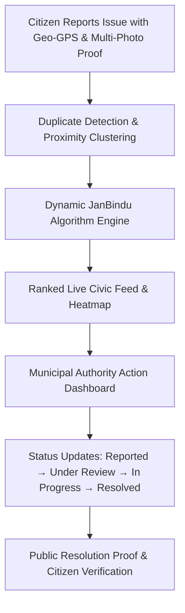
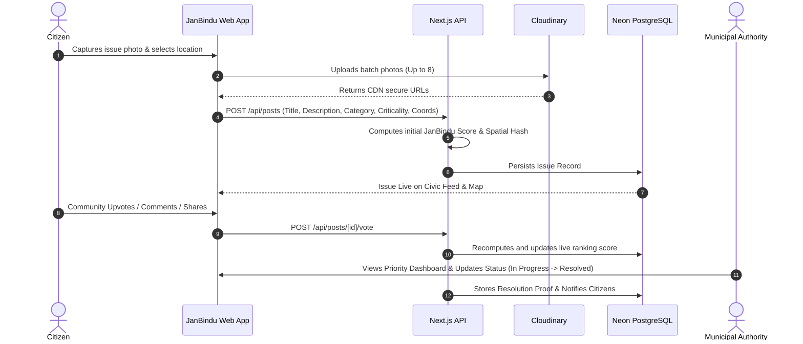
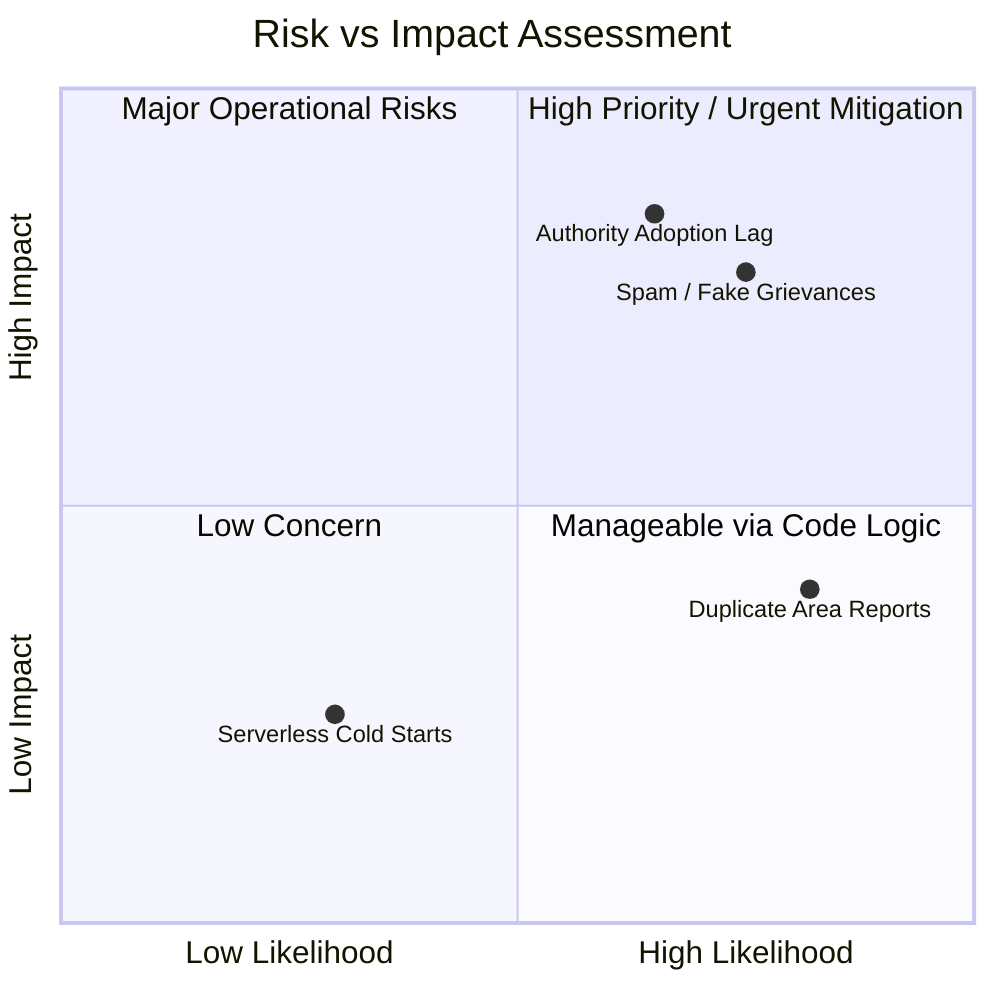
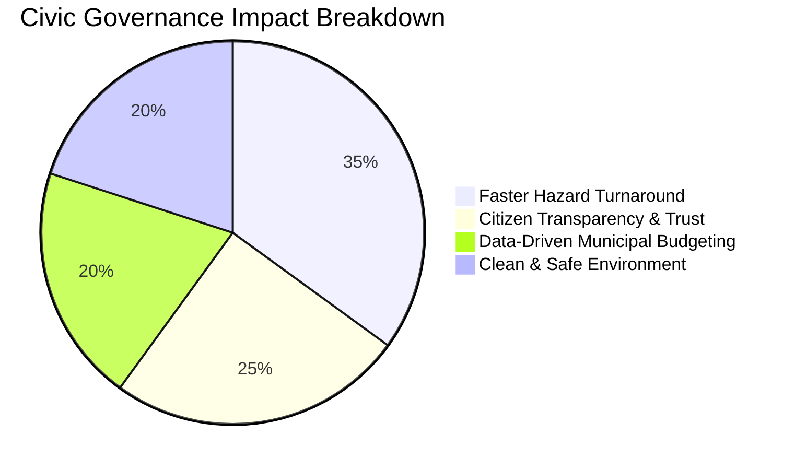

# Smart India Hackathon (SIH) 2026 — Idea Presentation
## Project: **JanBindu (जनबिन्दु)** — *Where Public Issues Become Priorities for Action*

---

## 📌 Slide 1: Title Page

| Field | Content / Answer |
| :--- | :--- |
| **Problem Statement ID** | *[Insert your SIH Problem Statement ID here, e.g., SIH-1642 / Custom]* |
| **Problem Statement Title** | Crowdsourced Civic Grievance Redressal & Dynamic Priority Allocation System |
| **Theme** | Smart Governance / Smart Cities & Urban Development / Citizen Engagement |
| **PS Category** | Software |
| **Team ID** | *[Insert your Registered Team ID]* |
| **Team Name** | *[Insert your Team Name registered on portal]* |
| **Tagline** | *Bridging Citizens and Civic Authorities through Algorithmic Urgency Prioritization* |

---

## 📌 Slide 2: Idea Title & Proposed Solution

### **Idea Title**: JanBindu (जनबिन्दु) — Intelligent Civic Prioritization Engine

### **1. Proposed Solution & Overview**
JanBindu is an intelligent civic-tech grievance platform that empowers citizens to crowdsource public infrastructure and sanitation issues (potholes, broken streetlights, water pipeline bursts, hazardous waste, illegal dumping) with verifiable geo-coordinates and multi-photo proof. 

Unlike traditional static grievance portals where tickets sit in a FIFO (First-In, First-Out) queue, JanBindu runs a **real-time dynamic scoring algorithm (JanBindu Priority Formula)** that autonomously calculates and ranks public urgency based on engagement velocity, location density, severity weight, and time-decay factors.



---

### **2. How It Addresses the Problem**
- **Eliminates Administrative Blind Spots**: Replaces manual filtering of hundreds of complaints with an objective, data-backed priority ranking.
- **Deters Spam & Duplicate Fatigue**: Proximity clustering groups multiple reports of the same incident (e.g., a massive water leak) into a single high-priority civic hotspot.
- **Proximity Highlighting**: Connects citizens to hyper-local problems occurring within a 500m–5km radius of their registered residence.
- **Transparent Accountability Loop**: Citizens track the live lifecycle of their report with public resolution photographic proof submitted by municipal ward officers.

---

### **3. Innovation and Uniqueness**
1. **Dynamic Urgency Algorithm**:
   $$\text{JanBindu Score} = \left( \frac{U - 0.5D + 2C + 3S}{1 + \alpha \cdot \Delta t} \right) \times W_{\text{criticality}} \times \left(1 + \beta \cdot N_{\text{cluster}}\right)$$
   *(Balancing upvotes $U$, downvotes $D$, comments $C$, shares $S$, time decay $\Delta t$, severity weight $W$, and spatial clustering $N$)*.
2. **Interactive Dual-Mode Interface**: 
   Seamless 1-tap switching between an **on-demand filtered card feed** and a **full-screen interactive GIS map** with animated place search fly-to zoom.
3. **Automated Escalation via Daily Cron Job**: Issues that remain unresolved in critical sectors gain automated priority escalation over time.
4. **Authority Analytics Suite**: Ward-level breakdown of resolution rate, average turnaround time (TAT), and category hotspots.

---

## 📌 Slide 3: Technical Approach & Architecture

### **1. Technology Stack**

| Layer | Technologies Used | Key Purpose |
| :--- | :--- | :--- |
| **Frontend Framework** | Next.js 14 (App Router), React 18, TypeScript | High-performance server-rendered UI, seamless dynamic routing |
| **Styling & Design** | Tailwind CSS 3.4, Lucide React Icons | Minimalist, ultra-responsive mobile-first design system |
| **Mapping & GIS** | Leaflet, React-Leaflet, OpenStreetMap Nominatim | Full-screen interactive map, forward/reverse geocoding, smooth flyTo zoom |
| **Backend & APIs** | Next.js Serverless Route Handlers (Edge & Node.js) | RESTful API endpoints for auth, issues, voting, and authority metrics |
| **Database & ORM** | Neon Serverless PostgreSQL, Prisma ORM 5.x | Scalable ACID relational database with connection pooling and relational indexing |
| **Media & Asset Pipeline** | Cloudinary CDN REST API | Multi-image parallel upload, automatic thumbnailing, and cloud compression |
| **Scheduled Tasks** | Vercel Cron (`0 0 * * *`) | Periodic score decay recalculation and SLA escalation |

---

### **2. End-to-End System Architecture**

```mermaid
flowchart TB
    subgraph ClientLayer [Client & User Interface]
        UI1[Mobile & Web Citizen UI]
        UI2[Authority Admin Portal]
        MAP[Interactive GIS Leaflet Map]
    end

    subgraph APILayer [Next.js App Router API & Middleware]
        AUTH[JWT / BCrypt Auth Middleware]
        POST_API[/api/posts - CRUD & Proximity Sort]
        VOTE_API[/api/posts/id/vote - Algorithmic Real-Time Recalculation]
        UPLOAD_API[/api/upload - Cloudinary Multi-File Batch Pipeline]
        CRON_API[/api/cron/recalculate-scores - Daily Decay Worker]
    end

    subgraph ServiceLayer [Cloud & Database Infrastructure]
        PRISMA[Prisma ORM Client]
        NEON[(Neon Serverless PostgreSQL DB)]
        CLOUDINARY[Cloudinary Media Storage]
        NOMINATIM[OSM Nominatim Geocoding API]
    end

    UI1 & UI2 & MAP --> AUTH
    AUTH --> POST_API & VOTE_API & UPLOAD_API & CRON_API
    POST_API & VOTE_API --> PRISMA
    PRISMA --> NEON
    UPLOAD_API --> CLOUDINARY
    MAP -.-> NOMINATIM
```

---

### **3. Implementation Methodology & Execution Flow**



---

## 📌 Slide 4: Feasibility and Viability

### **1. Feasibility Analysis**

| Parameter | Feasibility Metric | Implementation Detail |
| :--- | :--- | :--- |
| **Technical Feasibility** | **High (Working Prototype)** | Fully built and deployed on Next.js 14 App Router, Neon PostgreSQL, and Prisma ORM. |
| **Economic Viability** | **Zero-Cost Base Tier** | Utilizes serverless pay-per-use architecture (Neon Serverless + Vercel + Cloudinary free tier) capable of supporting 50,000+ monthly active users without server maintenance costs. |
| **Operational Feasibility** | **Minimal Onboarding** | Municipal departments require zero specialized software installation; accessible via standard web browsers on desktop/tablets. |
| **Legal & Data Privacy** | **Compliant** | Geo-coordinates are public only for civic infrastructure; citizen passwords use salted BCrypt hashes with JWT bearer authentication. |

---

### **2. Potential Challenges & Risk Mitigation Matrix**



| Risk / Challenge | Potential Impact | JanBindu Mitigation Strategy |
| :--- | :--- | :--- |
| **Spam / Fake Complaint Uploads** | Administrative clutter, false alarms | Mandatory multi-photo verification, GPS reverse geocoding bounds, and citizen downvoting penalty ($ -0.5 \times \text{downvotes}$). |
| **Duplicate Reports for Same Issue** | Fragmented community engagement | **Spatial Clustering**: Algorithm groups reports within a 50m radius and aggregates priority score rather than creating duplicate work tickets. |
| **Authority Inaction** | Citizen disillusionment | Public SLA aging timer, daily priority escalation cron, and transparent status progression (`Reported` $\to$ `Under Review` $\to$ `In Progress` $\to$ `Resolved`). |
| **Low Connectivity in Field** | Incomplete submissions | Progressive web caching, image compression before upload, and offline geolocation fallback. |

---

## 📌 Slide 5: Impact and Benefits



### **1. Impact on Target Audience**

- **Citizens & Communities**:
  - Direct democratic voice in prioritizing civic infrastructure repairs in their immediate neighborhood.
  - Zero red tape: 1-click photo reporting and live visual resolution tracking.
- **Municipal Authorities (Smart City Ward Officers / PWD / Jal Board)**:
  - Clear, data-driven daily work queue sorted by urgency score rather than arbitrary queues.
  - Ward-wise heatmaps reveal systemic failure points (e.g., chronic pipeline leakages or repeated transformer failures).

### **2. Multi-Dimensional Benefits**

| Category | Quantitative / Qualitative Benefits |
| :--- | :--- |
| **Social** | Promotes active civic stewardship; eliminates feelings of administrative neglect in underserved neighborhoods. |
| **Economic** | Prevents minor infrastructure failures (small potholes/minor leaks) from turning into costly road reconstructions or major flood damage. |
| **Environmental** | Rapid resolution of sewage overflows, illegal garbage dump hotspots, and water supply wastage saves millions of liters of clean water and curbs urban pollution. |
| **Governance** | Objective performance metrics (Average Resolution Time, Category Resolution Ratio) enable merit-based municipal evaluation. |

---

## 📌 Slide 6: Research, Benchmarks & References

### **1. Scientific & Mathematical Backing**
- **Hacker News / Reddit Dynamic Gravity Ranking**: Adapted gravity time-decay models ($Score / (t + 2)^G$) for physical infrastructure urgency decay and escalation.
- **Haversine Proximity Geodesic Model**: Real-time sphere distance calculations:
  $$d = 2R \arcsin\left(\sqrt{\sin^2\left(\frac{\Delta \phi}{2}\right) + \cos(\phi_1)\cos(\phi_2)\sin^2\left(\frac{\Delta \lambda}{2}\right)}\right)$$
- **Crowdsourced Civic Technology Research**: Inspired by global civic-tech case studies (*FixMyStreet UK*, *SeeClickFix USA*, *CPGRAMS India*), upgraded with automated algorithmic prioritization and geospatial clustering.

### **2. Comparative Benchmarks**

| Feature | CPGRAMS / Local Portals | Traditional Toll-Free Numbers | **JanBindu (जनबिन्दु)** |
| :--- | :---: | :---: | :---: |
| **Dynamic Priority Ranking** | ❌ (FIFO Only) | ❌ | ✅ **Algorithmic Dynamic Score** |
| **Interactive Live Heatmap** | ❌ | ❌ | ✅ **Full-Screen GIS Map with Fly-To Zoom** |
| **Multi-Photo Evidence Gallery** | ❌ (Single Attachment) | ❌ | ✅ **Batch CDN Upload (Up to 8 Photos)** |
| **Nearby Issues Filter** | ❌ | ❌ | ✅ **Haversine GPS Proximity (km / m away)** |
| **Public Transparency & Upvotes** | ❌ (Private Ticket) | ❌ | ✅ **Public Crowdsourced Democratic Engagement** |
| **On-Demand Minimal Filters** | ❌ | ❌ | ✅ **Collapsible Responsive Filter Bar** |

---

### **3. References & Repository**
- **Live Production Codebase**: [GitHub Repository: `tott1o/janbindu`](https://github.com/tott1o/janbindu.git)
- **Ministry of Housing and Urban Affairs (MoHUA)**: *Smart Cities Mission Guidelines on Citizen Engagement Frameworks.*
- **OpenStreetMap & Leaflet GIS**: *Open Geospatial Data Specifications for Urban Hazard Mapping.*
- **Neon Serverless Architecture**: *Scalable Multi-Tenant Relational Data Storage for High-Concurrency Citizen Platforms.*
